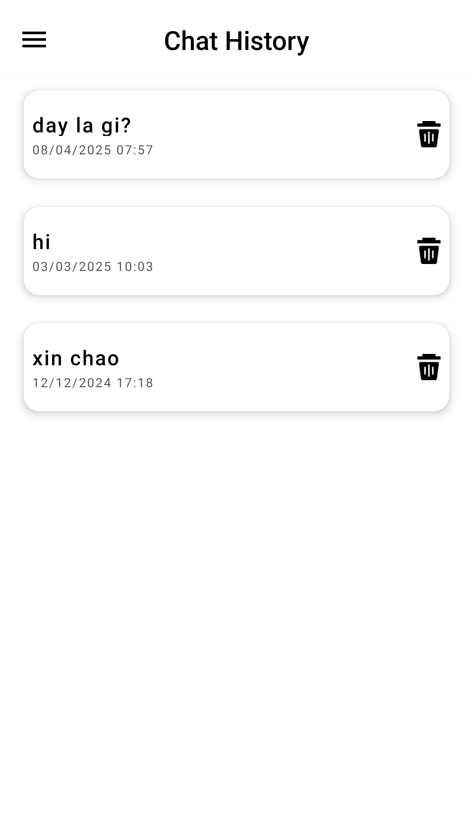
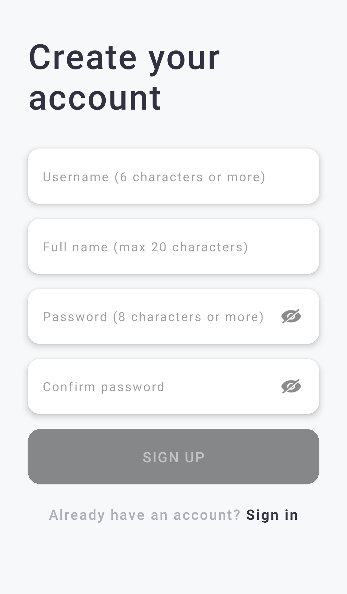

# **RYTON GPT** - AI Chatbot Application

## **Overview**

**Ryton GPT** is a **powerful AI-driven chatbot application** designed to provide *intelligent responses* and assist users with a variety of tasks. Built with advanced **natural language processing (NLP)** and **image analysis capabilities**, Ryton GPT aims to deliver a seamless and interactive user experience for both casual conversations and practical use cases.

## **Main Features**

### **1. AI-Powered Responses**
- **Intelligent Conversations**: Ryton GPT leverages cutting-edge AI technology to understand and respond to user queries in a *natural* and *context-aware* manner.
- **Multilingual Support**: Communicate in multiple languages, including *Vietnamese*, *English*, and more.
- **Context Retention**: Maintains conversation context to provide *coherent* and *relevant* responses over extended interactions.
- **Customizable Tone**: Adapts to different conversational styles, whether *formal*, *casual*, or *humorous*, based on user preferences.

### **2. Image Analysis**
- **Visual Recognition**: Upload images, and Ryton GPT can *analyze* and *describe* their content, such as identifying objects, food, or scenes.
- **Enhanced Interaction**: Combines image analysis with text-based responses for a *richer* user experience.

## **Screenshots**

### **Welcome Screen**
The welcome screen greets users upon launching the app, featuring the **Ryton GPT** logo and version information.

### **Chat Interface**
The main chat interface allows users to interact with **Ryton GPT** seamlessly. You can type messages, upload images, and receive AI-generated responses.

### **Chat History**
Easily access your previous conversations with the *chat history* feature.

### **Theme Selection**
Customize the app's appearance with *light*, *dark*, or *device-based* themes.

### **Sign-Up & Sign-In**
Create an account or sign in to save your chat history and preferences.

  

## **Getting Started**

### **Installation**
1. **Ryton GPT** is currently in beta and not yet available on the Google Play Store. You can experience the app by visiting [this link](https://byvn.net/3Pwr).
2. Follow the instructions on the website to try out the app.
3. **Sign up** for a new account or **sign in** with an existing one.

### **Usage**
1. **Start a Chat**: Open the app and begin typing your message or upload an image to start a conversation.
2. **Explore Features**: Ask questions, share images, or customize the app's theme to suit your preferences.
3. **Review History**: Access your *chat history* to revisit past conversations.

## **Example Interaction**
- **User**: *“Đây là gì?”* (Uploads an image of a dish)  
- **Ryton GPT**: Đây là một món ăn có thành phần chính là **trứng cá hồi**, thường được gọi là *“ikura”* trong ẩm thực Nhật Bản. Trứng cá hồi có **màu cam đỏ đặc trưng** và thường được phục vụ trong các món *sushi*, *sashimi* hoặc kèm với cơm. Món ăn này cũng được trang trí bằng một **nhánh thảo mộc xanh** ở phía trên.

## **Requirements**
- **Operating System**: Android 5.0+ 
- **Internet Connection**: Required for AI processing and responses

## **Contributing**
We welcome contributions to improve **Ryton GPT**! If you'd like to contribute, please fork the repository, make your changes, and submit a pull request.